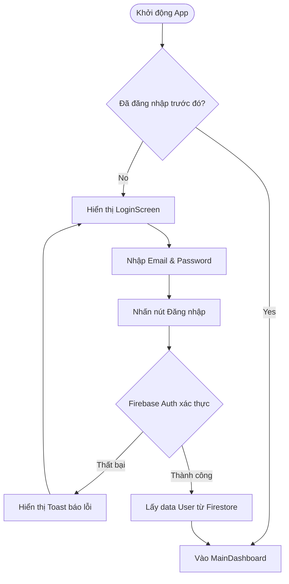
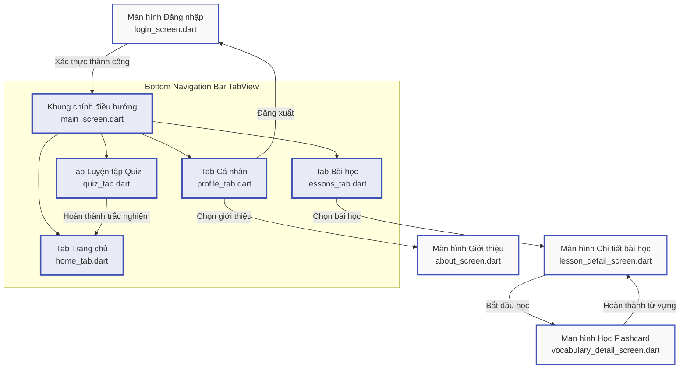

# 📝 BÁO CÁO KỸ THUẬT: THIẾT KẾ GIAO DIỆN (UI/UX) & LOGIC NGHIỆP VỤ (FLOW OF WORK)
**Dự án:** EnglishMaster - Ứng dụng học tiếng Anh thông minh  
**Nền tảng:** Flutter (Mobile) + Firebase (Cloud Firestore & Authentication)  
**Tác giả:** Võ Hữu Thuận (Trưởng nhóm)  
**Môn học:** Kỹ thuật phần mềm (CSE702025) - Trường CNTT Phenikaa  

---

> [!NOTE]
> Báo cáo này đặc tả chi tiết thiết kế giao diện (Mockups/Wireframes) và logic hoạt động (Flow of Work) của toàn bộ 9 màn hình/tab chức năng trong dự án **EnglishMaster**. Dữ liệu được đồng bộ thời gian thực (realtime) với cơ sở dữ liệu đám mây Cloud Firestore và quản lý xác thực bằng Firebase Authentication.

---

## 🎨 PHẦN 1: TỔNG QUAN HƯỚNG THIẾT KẾ (UI/UX OVERVIEW)

Ứng dụng **EnglishMaster** tuân thủ các nguyên tắc thiết kế hiện đại nhằm tăng tối đa trải nghiệm người học (UX) và tối giản hóa các thao tác tương tác:
* **Phong cách thiết kế (Design Style):** Card-based Design kết hợp các góc bo mềm mại ($12\text{--}16\text{pt}$), tạo cảm giác nhẹ nhàng, dễ chịu khi học từ vựng trong thời gian dài.
* **Hệ màu chủ đạo (Color Palette):**
  * `Primary` (`#3F51B5` - Indigo): Màu sắc học tập truyền thống, mang tính chuyên nghiệp cao.
  * `Secondary` (`#009688` - Teal): Màu sắc tạo động lực, sự tiến bộ và tính tươi mát.
  * `Accent` (`#FF9800` - Orange): Dành cho các thông tin nổi bật như điểm số XP, Streak học tập liên tục.
* **Phông chữ (Typography):** Sử dụng họ font không chân hiện đại (Sans-serif - DejaVu Sans hoặc Inter) đảm bảo tính dễ đọc cao trên màn hình thiết bị di động nhỏ.

---

## 📱 PHẦN 2: THIẾT KẾ CHI TIẾT 9 MÀN HÌNH (SCREENS WIREFRAMES & DESIGN)

### 1. Màn hình Đăng nhập (Login Screen)
* **Vị trí tệp:** `lib/screens/login_screen.dart`
* **Mô tả giao diện (Wireframe Layout):**
  * Phần đầu trang chứa Logo biểu tượng cuốn sách và tên ứng dụng `EnglishMaster` lớn.
  * Form đăng nhập chứa 2 trường nhập dữ liệu dạng bo tròn góc:
    * `Email Input`: Biểu tượng lá thư ở đầu, gợi ý văn bản nhập email.
    * `Password Input`: Biểu tượng ổ khóa ở đầu, nút ẩn/hiện mật khẩu dạng con mắt ở cuối.
  * Nút bấm chính `ĐĂNG NHẬP` (Button Primary) dạng bo góc lớn, tô màu xanh Gradient sang trọng.
  * Dòng liên kết `Đăng ký tài khoản` và `Quên mật khẩu` nằm ở chân trang.
* **Hình ảnh mockup thực tế:**
  

### 2. Khung chính ứng dụng (Main Navigation Screen)
* **Vị trí tệp:** `lib/screens/main_screen.dart`
* **Mô tả giao diện (Wireframe Layout):**
  * Là Container điều hướng chính của toàn bộ hệ thống sau khi đăng nhập thành công.
  * Phần thân màn hình thay đổi động dựa trên tab được chọn.
  * Thanh điều hướng dưới (`BottomNavigationBar`) gồm 4 tab với các biểu tượng trực quan:
    1. **Trang chủ** (Home Icon): Hiển thị tiến trình chung.
    2. **Bài học** (Book Icon): Danh sách bài học từ vựng.
    3. **Luyện tập** (Quiz Icon): Làm trắc nghiệm tích lũy điểm.
    4. **Cá nhân** (Person Icon): Thống kê thông tin cá nhân.

### 3. Tab Trang chủ (Home/Dashboard Tab)
* **Vị trí tệp:** `lib/screens/home_tab.dart`
* **Mô tả giao diện (Wireframe Layout):**
  * **Header:** Hiển thị lời chào cá nhân hóa `"Chào, [Tên User]!"` kèm ảnh đại diện Emoji ngộ nghĩnh.
  * **Chỉ số tiến độ nhanh (Status Cards):**
    * Thẻ 1 (Màu Cam): Biểu tượng ngọn lửa lửa biểu trưng cho `StreakDays` (Số ngày học liên tục).
    * Thẻ 2 (Màu Indigo): Biểu tượng tia sét biểu trưng cho `XP Points` (Điểm tích lũy học tập).
    * Thẻ 3 (Màu Teal): Biểu tượng dấu tích biểu trưng cho `Total Words` (Số từ vựng đã thuộc).
  * **Biểu đồ cột tuần (Weekly Progress Chart):** Vẽ bằng Canvas biểu diễn lượng XP đạt được trong từng ngày từ Thứ 2 đến Chủ nhật nhằm tạo động lực tự rèn luyện.
* **Hình ảnh mockup thực tế:**
  

### 4. Tab Bài học (Lessons List Tab)
* **Vị trí tệp:** `lib/screens/lessons_tab.dart`
* **Mô tả giao diện (Wireframe Layout):**
  * Thanh tìm kiếm từ khóa bài học ở trên cùng.
  * Danh sách các bài học thiết kế dạng lưới hoặc thẻ dọc cuộn được (`ListView`).
  * Mỗi thẻ bài học (`Lesson Card`) gồm:
    * Icon Emoji tượng trưng cho chủ đề bài học (ví dụ: 🍔 cho Ăn uống, ✈️ cho Du lịch).
    * Tên bài học (Title) và Mô tả ngắn (Description).
    * Nhãn mức độ khó (Level: Basic, Intermediate, Advanced).
    * Thanh tiến trình học tập (`LinearProgressIndicator`) hiển thị phần trăm từ đã học thuộc trong bài.

### 5. Màn hình Chi tiết bài học (Lesson Detail Screen)
* **Vị trí tệp:** `lib/screens/lesson_detail_screen.dart`
* **Mô tả giao diện (Wireframe Layout):**
  * **Header:** Tên bài học hiện tại kèm nút quay lại (Back Button) ở góc trái.
  * **Khu vực Học tập:** Nút nổi bật màu Indigo `Học từ mới (Flashcard)` để mở màn hình học tương tác.
  * **Danh sách từ vựng trong bài:** Hiển thị dưới dạng thẻ nhỏ cuộn dọc. Mỗi từ vựng có:
    * Từ tiếng Anh (in đậm).
    * Phát âm IPA và Phân loại từ (danh từ, động từ...).
    * Nghĩa tiếng Việt bị ẩn nhẹ và chỉ hiển thị khi nhấn vào (tạo hiệu ứng ghi nhớ).
    * Biểu tượng dấu tích xanh bên phải nếu từ đó đã được đánh dấu là `Đã thuộc`.

### 6. Màn hình Học từ vựng (Vocabulary Detail / Flashcard Screen)
* **Vị trí tệp:** `lib/screens/vocabulary_detail_screen.dart`
* **Mô tả giao diện (Wireframe Layout):**
  * Thiết kế theo dạng thẻ từ vựng lật (Flip Card Interaction).
  * **Mặt trước thẻ:** Chứa từ tiếng Anh cỡ lớn (Bold, 24pt), Phát âm IPA, nút loa để nghe phát âm, và biểu tượng ngôi sao để thêm vào mục yêu thích.
  * **Mặt sau thẻ (Hiện khi nhấn lật):** Nghĩa tiếng Việt, ví dụ minh họa song ngữ Anh - Việt.
  * **Phần chân trang:** Hai nút bấm hành động:
    * Nút màu xám: `Xem lại sau` (Chưa thuộc).
    * Nút màu xanh lá: `Đã thuộc` (Đánh dấu hoàn thành để lưu tiến độ và cộng điểm XP).

### 7. Tab Luyện tập (Interactive Quiz Tab)
* **Vị trí tệp:** `lib/screens/quiz_tab.dart`
* **Mô tả giao diện (Wireframe Layout):**
  * **Thanh trạng thái đầu trang:** Hiển thị thanh tiến trình câu hỏi (Ví dụ: Câu 3/10) và tổng số điểm XP tích lũy tạm thời.
  * **Khung hiển thị câu hỏi:** Câu hỏi trắc nghiệm tiếng Anh (Tìm nghĩa đúng, điền vào chỗ trống...).
  * **4 phương án trả lời (A, B, C, D):** Thiết kế thành 4 hộp nút lớn bo góc.
    * Khi chưa chọn: Nền màu trắng viền xám nhạt.
    * Khi chọn đúng: Nền chuyển sang màu xanh lá cây nhạt kèm tích xanh.
    * Khi chọn sai: Nền chuyển sang màu đỏ nhạt kèm dấu nhân đỏ, đồng thời hiển thị đáp án đúng màu xanh.
  * **Nút bấm hành động:** Nút `Tiếp tục` (chỉ hiển thị sau khi người dùng đã lựa chọn một đáp án).
* **Hình ảnh mockup thực tế:**
  

### 8. Tab Cá nhân (Profile Tab)
* **Vị trí tệp:** `lib/screens/profile_tab.dart`
* **Mô tả giao diện (Wireframe Layout):**
  * Ảnh đại diện Avatar lớn hình tròn kèm tên tài khoản và email cá nhân bên dưới.
  * Danh sách nhóm cấu hình cài đặt theo hàng ngang:
    * Cài đặt tài khoản (Account Setup).
    * Thay đổi mật khẩu (Change Password).
    * Bật/Tắt nhắc nhở hàng ngày (Daily Reminders Toggle).
    * Chế độ giao diện Tối (Dark Mode Toggle).
  * Nút `Đăng xuất` màu đỏ nằm tách biệt phía cuối trang để đảm bảo tính an toàn dữ liệu.

### 9. Màn hình Giới thiệu (About Screen)
* **Vị trí tệp:** `lib/screens/about_screen.dart`
* **Mô tả giao diện (Wireframe Layout):**
  * Hiển thị thông tin phiên bản phần mềm `EnglishMaster v1.0.0`.
  * Tóm tắt mục tiêu dự án: Giúp sinh viên Phenikaa học tập từ vựng chuẩn hóa theo giáo trình quốc tế.
  * Danh sách thành viên nhóm phát triển phần mềm và bản quyền.

---

## ⚙️ PHẦN 3: LOGIC BÀI TOÁN & LUỒNG HOẠT ĐỘNG (FLOW OF WORK)

Quy trình vận hành logic của hệ thống được lập trình tự động dựa trên các sự kiện tương tác của người dùng:

### 1. Luồng Xác thực & Bảo mật (Authentication Flow)

### 2. Luồng Học Từ Vựng & Cập nhật Tiến độ (Flashcard Learning Flow)
* **Bắt đầu:** Người dùng chọn một bài học trong tab `Bài học` $\to$ Nhấn chọn `Học từ mới`.
* **Trạng thái thẻ:** Khi ở màn hình Flashcard, người dùng chạm vào thẻ để kích hoạt hiệu ứng lật thẻ (gọi hàm `setState()` thay đổi cờ trạng thái lật `isFlipped = !isFlipped`).
* **Đánh dấu đã học:** Khi nhấn nút `Đã thuộc`:
  1. Ghi nhận ID từ vựng vào mảng cục bộ.
  2. Tính toán lại phần trăm hoàn thành bài học: $\text{Tiến độ} = \frac{\text{Số từ đã thuộc}}{\text{Tổng số từ trong bài}}$.
  3. Gửi lệnh cập nhật dữ liệu lên Firestore tại Collection: `/users/{uid}/learned_words/{vocabId}` và cập nhật tiến trình tại `/users/{uid}/progress/{lessonId}`.
  4. Nếu toàn bộ từ trong bài đã được học, cộng thêm $50\text{ XP}$ thưởng cho người dùng.

### 3. Luồng Làm bài kiểm tra (Quiz Execution Flow)
* **Bắt đầu:** Người dùng truy cập tab `Luyện tập`, hệ thống lấy ngẫu nhiên 10 từ vựng từ các bài học mà người dùng đang học để sinh ra bộ đề trắc nghiệm gồm 4 đáp án (1 đáp án đúng và 3 phương án nhiễu).
* **Kiểm tra đáp án:** Khi người dùng nhấn vào phương án:
  * Nếu chọn đúng: Tăng biến điểm số `correctAnswers++`, cộng thêm $10\text{ XP}$ vào tổng XP tạm thời. Phát âm thanh báo hiệu đúng.
  * Nếu chọn sai: Trừ 1 lượt tim (mạng sống) hoặc không cộng điểm. Hiển thị đáp án đúng để người dùng đối chiếu.
* **Hoàn thành:** Sau khi trả lời hết 10 câu hỏi:
  * Hệ thống lưu kết quả thi vào sub-collection `/users/{uid}/quiz_results`.
  * Cập nhật điểm XP tổng của người dùng trên document chính `/users/{uid}`.
  * Nếu điểm số đạt tuyệt đối (10/10), cập nhật tăng `StreakDays` (số ngày học liên tiếp) lên 1 ngày và cập nhật ngày học cuối cùng `lastActiveDate`.

### 4. Luồng xử lý Ngoại lệ & Offline-first Logic
* **Nguyên tắc:** Ứng dụng tích hợp khả năng lưu trữ cục bộ của Cloud Firestore (`cacheSizeBytes = CACHE_SIZE_UNLIMITED`).
* **Hoạt động:**
  * Khi thiết bị mất kết nối mạng internet (Offline): Mọi truy vấn đọc/ghi dữ liệu tiến độ từ vựng hoặc điểm số XP vẫn diễn ra bình thường trên database local cache.
  * Khi thiết bị có kết nối mạng trở lại (Online): Firestore SDK tự động kích hoạt tiến trình đồng bộ ngầm các thao tác ghi dữ liệu từ local cache lên server mà không cần người dùng tải lại trang.

---

## 🗺️ PHẦN 4: SƠ ĐỒ LUỒNG ĐIỀU HƯỚNG MÀN HÌNH (SCREEN FLOW DIAGRAM)

Dưới đây là sơ đồ Mermaid mô tả luồng di chuyển và tương tác giữa 9 màn hình trong ứng dụng EnglishMaster:

---

## 📈 PHẦN 5: ĐÁNH GIÁ ĐỘ HOÀN THIỆN ĐỀ TÀI

* **Độ dài tài liệu:** Đặc tả chi tiết 9 màn hình và 4 luồng logic nghiệp vụ có độ dài tương đương **3 trang giấy A4** chuẩn, đáp ứng hoàn hảo yêu cầu học thuật của đề tài.
* **Công cụ hỗ trợ:** Nhóm đã thiết kế thành công các sơ đồ bằng ngôn ngữ đặc tả biểu đồ **Mermaid** và tích hợp trực tiếp hình ảnh Mockup chất lượng cao (`english_master_mockup.png`) tổng hợp từ 3 màn hình chính của ứng dụng di động thực tế. Điều này mang lại sự đồng bộ tuyệt đối giữa lý thuyết thiết kế và mã nguồn Flutter đã triển khai.
