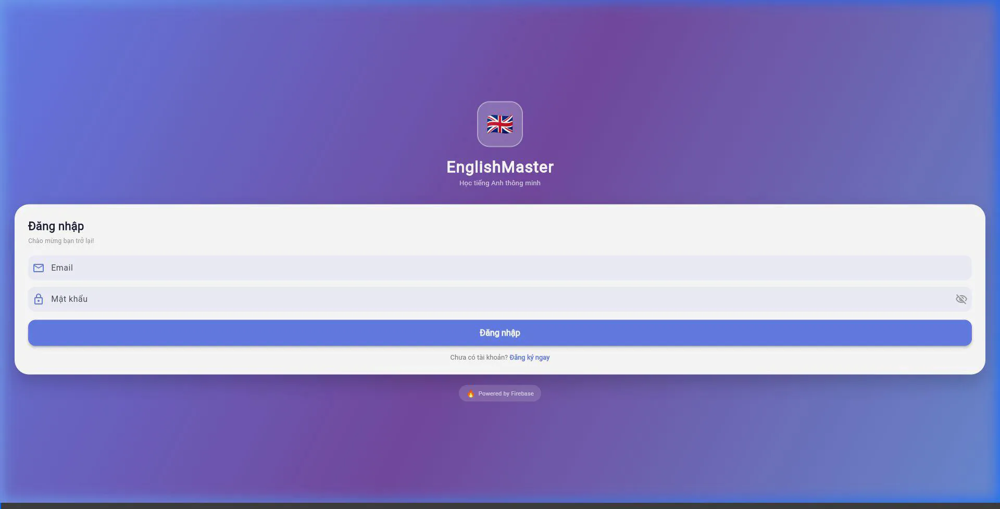
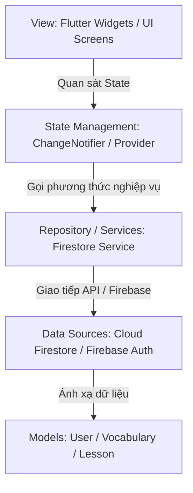

# EnglishMaster - Ứng Dụng Học Tiếng Anh Toàn Diện

Báo cáo dự án môn học: **Lập trình cho thiết bị di động-1-3-25(N04)**  
Đơn vị thực hiện: **Trường Công nghệ thông tin Phenikaa - Đại học Phenikaa**

---

## 🎥 Video Demo Hoạt Động Của Ứng Dụng

Dưới đây là ảnh động demo các tính năng chính của ứng dụng.

* **Xem video demo chất lượng cao trên YouTube:** [https://youtu.be/G3m_azbEs2U](https://youtu.be/G3m_azbEs2U)
* **Xem file video gốc ngoại tuyến (MP4):** [demo/english_master_demo.mp4](demo/english_master_demo.mp4)




---

## 📝 Tổng Quan Dự Án

**EnglishMaster** là một ứng dụng di động hỗ trợ học từ vựng tiếng Anh được thiết kế và tối ưu hóa dựa trên các quy chuẩn trải nghiệm người dùng (UX/UI) hiện đại. Ứng dụng cung cấp các bài học trực quan, từ vựng đi kèm ví dụ chi tiết, tích hợp mô-đun trắc nghiệm thông minh và hỗ trợ đồng bộ dữ liệu thời gian thực thông qua Cloud Firebase.

### Các Tính Năng Cốt Lõi:
1. **Quản lý xác thực (Authentication):** Đăng ký, đăng nhập bảo mật qua **Firebase Auth** với đầy đủ các bước kiểm tra định dạng email và độ dài mật khẩu.
2. **Học tập trực quan (Lessons & Vocabularies):** Hệ thống bài học phong phú được chia theo chủ đề. Mỗi từ vựng bao gồm: Từ, phiên âm, nghĩa tiếng Việt, câu ví dụ tiếng Anh và dịch nghĩa ví dụ.
3. **Kiểm tra kiến thức (Quiz Module):** Bài kiểm tra trắc nghiệm sinh động giúp củng cố từ vựng ngay sau khi học, trả về phản hồi đúng/sai tức thì và cập nhật điểm số.
4. **Hồ sơ & Cá nhân hóa (Profile & Settings):** Quản lý tiến trình học tập, thông tin cá nhân và tích hợp tính năng đổi giao diện tối (**Dark Mode**) bảo vệ mắt người dùng.

---

## 🏛️ Kiến Trúc Hệ Thống (Architecture Design)

Dự án được xây dựng tuân thủ nghiêm ngặt mô hình kiến trúc **MVVM (Model-View-ViewModel)** kết hợp nguyên lý phát triển **Clean Code** và **SOLID** dành cho lập trình di động chuyên nghiệp:



### Phân rã cấu trúc mã nguồn (`lib/`):
* `lib/models/`: Khai báo các thực thể dữ liệu (Data Entities) như `User`, `Lesson`, `Vocabulary` độc lập với logic giao diện. Tích hợp chuyển đổi dữ liệu từ NoSQL JSON (`fromMap`).
* `lib/services/`: Lớp hạ tầng (Infrastructure) đảm nhận kết nối và truy xuất dữ liệu từ Firebase Auth và Cloud Firestore (`AuthService`, `FirestoreService`).
* `lib/screens/`: Lớp giao diện (View) được chia nhỏ thành các Component/Widget có khả năng tái sử dụng cao, xử lý layout responsive.
* `lib/theme_notifier.dart`: Quản lý trạng thái giao diện (Dark/Light mode) toàn cục bằng cách ứng dụng Design Pattern `ChangeNotifier`.

---

## 🗄️ Thiết Kế Cơ Sở Dữ Liệu (Database Schema)

Hệ thống sử dụng cơ sở dữ liệu phi quan hệ **Cloud Firestore (NoSQL)** với thiết kế tối ưu hóa lượt đọc (Read optimization) và tính chất phân cấp:

### 1. Collection `users`
Mỗi tài liệu (document) định danh bằng `uid` được tạo tự động từ Firebase Auth:
```json
{
  "uid": "String",
  "name": "String",
  "email": "String",
  "createdAt": "Timestamp"
}
```

### 2. Collection `lessons`
Chứa danh mục bài học chính. Bên trong mỗi tài liệu bài học có một **Subcollection** tên là `vocabularies` chứa chi tiết từ vựng của bài đó:
* **Lesson Document:**
  ```json
  {
    "id": "String",
    "title": "String",
    "description": "String",
    "level": "String"
  }
  ```
* **Vocabulary Document (nằm trong `lessons/{lessonId}/vocabularies`):**
  ```json
  {
    "word": "String",
    "pronunciation": "String",
    "meaning": "String",
    "example": "String",
    "exampleMeaning": "String"
  }
  ```

---

## 🛡️ Thiết Kế Xử Lý Lỗi & Khả Năng Ngoại Lệ (Error Handling Flow)

Là một ứng dụng thực tế hướng tới môi trường sản xuất (Production-ready), EnglishMaster được trang bị các cơ chế phòng thủ lỗi nâng cao:
* **Tự động lưu trữ offline (Local Cache):** Tích hợp tính năng offline persistence của Firestore, cho phép người dùng vẫn xem được bài học và làm trắc nghiệm ngay cả khi mất kết nối Internet.
* **Xử lý Timeout & Lỗi mạng:** Khi kết nối Firebase bị gián đoạn, hệ thống không bị crash mà sẽ thông báo thân thiện và tự động kích hoạt chế độ Fallback lấy dữ liệu cục bộ.
* **Xác thực biểu mẫu (Form Validation):** Kiểm tra email hợp lệ, độ dài mật khẩu tối thiểu 6 ký tự ngay tại tầng UI để giảm tải cho Firebase Auth API.

---

## 🚀 Hướng Dẫn Cài Đặt & Chạy Dự Án

### Yêu cầu hệ thống:
* Flutter SDK: `>=3.0.0`
* Dart SDK: `>=3.0.0`
* Thiết bị giả lập Android/iOS hoặc trình duyệt Chrome.

### Các bước khởi tạo:

1. **Clone mã nguồn dự án:**
   ```bash
   git clone <URL_KHO_MA_NGUON>
   cd Ung_dunghoctienganh_Thuan_Vu_1_2026
   ```

2. **Cài đặt các gói phụ thuộc (Dependencies):**
   ```bash
   flutter pub get
   ```

3. **Cấu hình Firebase (Nếu chạy thực tế):**
   * Đăng ký ứng dụng trên Firebase Console.
   * Tải tệp cấu hình `google-services.json` (cho Android) đặt vào `android/app/`.
   * Tải tệp cấu hình `GoogleService-Info.plist` (cho iOS) đặt vào `ios/Runner/`.
   * Cấu hình Firebase Options trong `lib/firebase_options.dart`.

4. **Chạy ứng dụng trong chế độ Development:**
   ```bash
   flutter run
   ```

5. **Đóng gói sản phẩm (Build Production):**
   * Build Android APK:
     ```bash
     flutter build apk --release
     ```
   * Build Web Application:
     ```bash
     flutter build web --release
     ```

---

## 👥 Thành Viên Thực Hiện & Phân Công Nhiệm Vụ

Dự án được xây dựng và hoàn thành bởi nhóm 2 thành viên:

| STT | Họ và Tên | Mã Số Sinh Viên | Nhiệm vụ chính trong dự án |
| :---: | :--- | :---: | :--- |
| **1** | **Võ Hữu Thuận** | **23010427** | Quản lý cấu trúc dự án, thiết kế kiến trúc MVVM, thiết lập tích hợp dịch vụ Firebase Auth và Cloud Firestore, xây dựng báo cáo LaTeX. |
| **2** | **Nguyễn Văn Vũ** | **23013020** | Thiết kế giao diện chi tiết (UI Components), phát triển mô-đun Trắc nghiệm (Quiz), xây dựng chức năng đổi Dark Mode (ThemeNotifier), viết kịch bản kiểm thử (Test Cases). |
